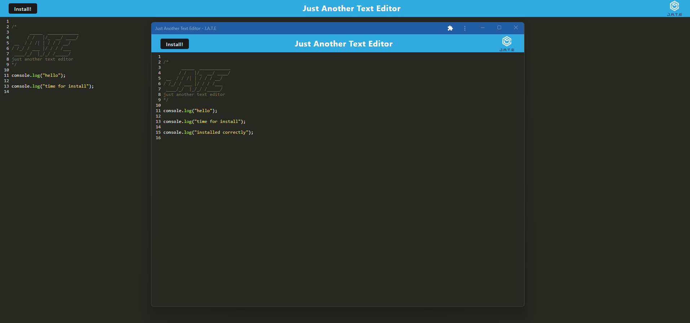

# 19 Progressive Web Applications (PWA): Text Editor

## Description

The purpose of this assignment was to create an application that allows the user to create notes and code snippets with or without the internet so that they can be relibaly retreived for later use. The user is able to install the application locally to their computer as it is pinned to their task bar and runs reliaby without an internet connection.

The features used throughout this project consist of:

- Javascript
- Concurrently
- Node.js
- Nodemon
- Webpack
- if-env
- Express
- Path
- idb
- Babel
- Heroku

## Acceptance Criteria

```md
GIVEN a text editor web application
WHEN I open my application in my editor
THEN I should see a client server folder structure
WHEN I run `npm run start` from the root directory
THEN I find that my application should start up the backend and serve the client
WHEN I run the text editor application from my terminal
THEN I find that my JavaScript files have been bundled using webpack
WHEN I run my webpack plugins
THEN I find that I have a generated HTML file, service worker, and a manifest file
WHEN I use next-gen JavaScript in my application
THEN I find that the text editor still functions in the browser without errors
WHEN I open the text editor
THEN I find that IndexedDB has immediately created a database storage
WHEN I enter content and subsequently click off of the DOM window
THEN I find that the content in the text editor has been saved with IndexedDB
WHEN I reopen the text editor after closing it
THEN I find that the content in the text editor has been retrieved from our IndexedDB
WHEN I click on the Install button
THEN I download my web application as an icon on my desktop
WHEN I load my web application
THEN I should have a registered service worker using workbox
WHEN I register a service worker
THEN I should have my static assets pre cached upon loading along with subsequent pages and static assets
WHEN I deploy to Heroku
THEN I should have proper build scripts for a webpack application
```

## Installation

To install the necessary packages, type 'npm i concurrently', npm i express', 'npm i path', and finally 'npi run install', the latter installing all the web pack features needed, in the terminal. 

## Usage

Once the necessary packages are installed, type 'npm run start' to start and run the server, a HTML file, service worker and manifest file will then be generated in the dist folder. 

A database storage will then be stored using the IndexedDB. Open the application and type any code snippets or notes that you wish. If you click off the application, the inputted information will be still be stored in the database thanks to the IndexedDB. 

Click the 'Install' button to download the web application as an icon on your desktop, which can be used locally without an internet connection. 

Here is a link to the deployed application - https://pwa-text-editor-challenge-b3032c8d83ab.herokuapp.com/

Here's a few screenshots of the deployed application, installed web application, service workers, manifest, and storage details.





## Credits

N/A

## License

N/A
